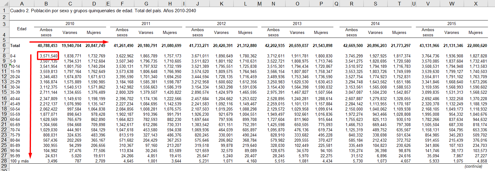
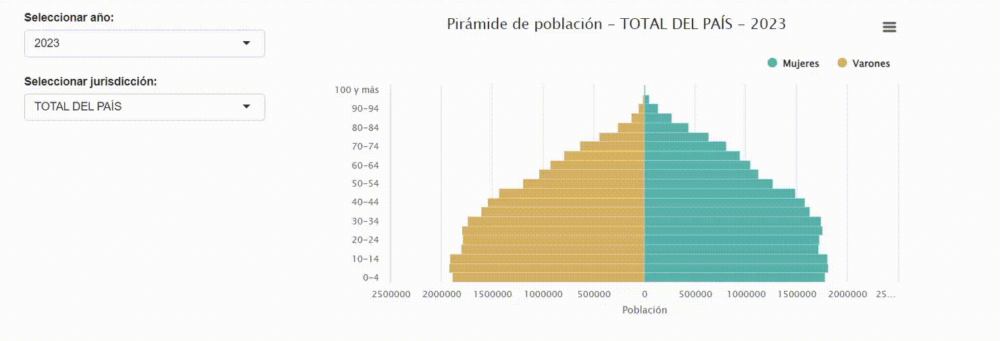

```{r setup, include=FALSE}
knitr::opts_chunk$set(echo = TRUE)
```

## Proyecciones de población

El **Instituto Nacional de Estadística y Censos (INDEC)** es el encargado de elaborar la proyecciones de población en Argentina, en base a los censos de población, hogares y vivienda.

La serie de proyecciones más actualizada es la desarrollada en base al Censo Nacional de Población, Hogares y Viviendas 2010 y se encuentra disponible en <https://www.indec.gob.ar/indec/web/Nivel4-Tema-2-24-85>

El material publicado en el sitio web del Instituto aparece en dos formatos disponibles para descarga: 

+ Documento .pdf 
+ Planilla de cálculos .xls

Ambos formatos resultan habitualmente poco amigables para docentes, investigadores y público relacionado con las estadísticas y la ciencia de datos. En primer lugar, el formato .pdf resulta adecuado para la impresión del documento y su visualización, pero no para la utilización de los datos en softwares de procesamiento. Por otro lado, las planillas .xls disponibles presentan un diseño en tabulados contiguos, fragmentados en distintas hojas que representan a las jurisdicciones, lo que torna muy laborioso reconstruir series temporales sin un trabajo arduo de copiado y pegado que aumenta el riesgo de cometer errores.

<br/>

## Objetivo

El objetivo de este documento es presentar una forma programática de procesamiento de las proyecciones de poblacion 2010-2040 publicadas por el INDEC, usando el software estadístico R [@R-base] con sus librerías dplyr, shiny [@Shiny], openxlsx [@openxlsx] y readxl [@readxl].

<br/>

## Desarrollo


### 1- Instalar y cargar librerías

Como se mencionó más arriba, se utilizarán las librerías dplyr, openxl y readxl, que deben estar previamente instaladas.

```{r eval=FALSE}
library(dplyr)
library(readxl)
library(openxlsx)
library(highcharter)
```


<br/>

### 2- Descargar proyecciones de población en formato .xls de la web del INDEC

```{r}
url = "https://www.indec.gob.ar/ftp/cuadros/poblacion/c2_proyecciones_prov_2010_2040.xls"
download.file(url, destfile = "poblacion.xls", mode="wb")
```
### 3- Crear una variable con los nombres de las hojas de la planilla descargada.
Esto se puede hacer a través de la función excel_sheets de readxl

```{r}
sheets = readxl::excel_sheets("poblacion.xls")
print(sheets)
```
Eliminar el nombre de la primera hoja de la planilla en la variable (ya que no contiene información)

```{r}
sheets = sheets[sheets!="GraphData"]
```

### 4 - Explorar de la planilla descargada y preparar las variables que nos van a ayudar a tabular los datos

Todas las hojas presentan cuadros con la información de interés.
Cada cuadro ocupa 21 filas y 3 columnas más una vacía utilizada como margen, comenzando el primero en la celda "B8"

```{r}

```


El diseño de cada hoja (que representa a una jurisdicción) se compone de 5 bloques horizontales de 6 cuadros cada uno y un bloque final (el sexto) de un cuadro.
Con una sequencia vamos a obtener la columna en la que empieza cada cuadro.
Identificamos a la letra "B" usando el vector LETTERS que incluye con R. En este caso, la letra "B" es la segunda del vector. Iremos agregando los múltiplos de 4 hasta completar las 5 columnas.

```{r}
columnas = c(LETTERS[2],LETTERS[2+4],LETTERS[2+4*2],LETTERS[2+4*3],LETTERS[2+4*4],LETTERS[2+4*5]) # columnas donde comienzan los cuadros
print(columnas)
```

Ahora obtendremos las filas donde empiezan los cuadros. Entre la longitud de los cuadros (21 filas) más los espacios y los totales que no utilizaremos, vemos que cada cuadro comienza 28 filas debajo del bloque anterior. Multiplicamos hasta obtener las filas iniciales de cada bloque. 

```{r}
filas = c(8, 8+28, 8+28*2, 8+28*3, 8+28*4, 8+28*5) # filas donde empiezan los bloques
print(filas)
```

Con el comando expand.grid obtendermos todas las combinaciones de fila y columna donde comienzan los cuadros

```{r}
columnas_y_filas = list(
  columnas,
  filas
)

columnas_y_filas = expand.grid(columnas_y_filas)
```

Eliminamos las ultimas 5 combinaciones ya que el último bloque sólo dispone de un cuadro

```{r}
columnas_y_filas = columnas_y_filas[1:(nrow(columnas_y_filas)-5),] 
```

Pegamos ambas columnas para obtener los identificadores de celdas tal como los usa Excel

```{r}
celdas = paste0(columnas_y_filas$Var1,columnas_y_filas$Var2) 
print(celdas)
```

**Ya tenemos entonces la lista de todas las celdas que representan la primera celda (arriba y a la izquierda) de cada uno de los bloques donde se encuentran las proyecciones para un año y jurisdicción específicos**

<br/>

Agregamos ahora unos pasos que servirán para agregar las columnas de jurisdicción, sexo y edad en la tabla final

```{r message=FALSE, warning=FALSE}
# creamos un vector con los grupos de edad que utiliza INDEC en las proyecciones. Podemos hacerlo desde el rango A8:A28 de la primera hoja, por ejemplo.
grupos_de_edad = readxl::read_xls("poblacion.xls", sheet = sheets[1], range = "A8:A28", col_names = F)[[1]]

# hacemos lo mismo con la variables sexo desde B4:D4
sexo = colnames(readxl::read_xls("poblacion.xls", sheet = sheets[1], range = "B4:D4"))

# hacemos lo mismo con los años
anos = 2010:2040
```

Ya tenemos toda la información que necesitamos:
 
 + Las jurisdicciones (a partir de los nombres de las hojas, en la variable sheets)
 + Los grupos de edad (en la variable grupos_de_edad)
 + Las categorías de sexo (en la variable sexo)
 + Las celdas donde empieza cada bloque (en la variable celdas)

### 5 - Tabulado

Vamos a hacer ahora un loop que recorra hoja por hoja y extraiga cada cuadro ubicándolo en un data.frame uno debajo del otro, e identificando la jurisdicción y el grupo de edad en filas y el sexo en columnas

```{r message=FALSE, warning=FALSE}

resultado = data.frame() # creamos en data.frame vacío donde se guardarán los resultados

for (i in sheets[1]) { # recorre las hojas del archivo original
  for (j in celdas) { # recorre cada una de las celdas donde comienza un bloque de datos
    ano=anos[which(celdas==j)] # identifica el año del bloque que está capturando
    rango = c(j,
              paste0(LETTERS[which(LETTERS==substring(j,1,1))+2],as.numeric(substring(j,2,4))+20)) 
    rango = paste(rango,collapse = ":") # obtiene el rango de celdas del bloque
    cuadro = readxl::read_xls("poblacion.xls", sheet = i, range = rango, col_names = F) # lee el bloque
    colnames(cuadro) = sexo # pone nombre de columnas a los datos obtenidos
    cuadro$ano = ano # agrega el año de los datos
    cuadro$juri = i # agrega la jurisdicción a los datos
    cuadro$edad = grupos_de_edad # agrega las etiquetas de los grupos de edad
    resultado = rbind(
      resultado,
      cuadro[,c(4,5,6,1,2,3)]
    ) # une los datos obtenidos al data frame donde se almacenarán todos (resultado)
  }
}

```

Ahora sí, contamos con un data frame que contien los datos en un formato amigable:

```{r warning=FALSE}
print(resultado)
```

Podemos mejorar la presentación de los datos

```{r}
# separamos los códigos de jurisdicción de los nombres
resultado$juri_nombre = substring(resultado$juri,4,max(nchar(resultado$juri)))
resultado$juri = substring(resultado$juri,1,2)
```

También podemos usar tidyr para pasar la variable sexo a las filas

```{r}
library(tidyr)

resultado = resultado %>% pivot_longer(cols = 4:6,
                                       names_to = "sexo_nombre",
                                       values_to = "poblacion") # pasa sexo a filas

# codifica sexo
resultado$sexo_codigo = ""
resultado$sexo_codigo[resultado$sexo_nombre=="Ambos sexos"] = "0"
resultado$sexo_codigo[resultado$sexo_nombre=="Varones"] = "1"
resultado$sexo_codigo[resultado$sexo_nombre=="Mujeres"] = "2"

resultado = resultado[,c(1,2,4,7,5,3,6)] # ordena columnas
head(resultado)

```

### 6 - Visualización

Finalmente, podemos hacer una visualización sencilla de los datos usando los paquetes shiny, highcharter y htmlwidgets.


```{r echo=TRUE, eval=FALSE}

library(shiny)
library(dplyr)
library(highcharter)
library(shinyWidgets)

ui <- fluidPage(
  column(3,
         br(),
         selectizeInput(inputId = "ano", 
                        label = "Seleccionar año:", 
                        choices = unique(resultado$ano),
                        selected = substring(Sys.Date(),1,4)),
         selectizeInput(inputId = "juri", 
                        label = "Seleccionar jurisdicción:", 
                        choices = unique(resultado$juri_nombre))
  ),
  column(6,
         br(),
         highchartOutput("grafico")),
  column(3)
) 

# definimos la lógica para elaborar el gráfico de pirámides a partir de la información ingresada en la ui
server <- function(input, output, session) {
  output$grafico = renderHighchart({
    datos_grafico = resultado[
      resultado$ano==input$ano &
        resultado$sexo_codigo!="0" &
        resultado$juri_nombre==input$juri,]
    
    highchart() %>%
      hc_chart(type = "bar") %>%
      hc_title(text = paste("Pirámide de población", "-", input$juri, "-", input$ano)) %>%
      hc_xAxis(categories = rev(unique(datos_grafico$edad))) %>%
      hc_yAxis(title = list(text = "Población"),
               labels = list(formatter = JS( 
                 "function() {    
                    return Math.abs(this.value); 
                  }"
               )),
               max = max(datos_grafico$poblacion)*1.1,
               min = max(datos_grafico$poblacion)*1.1*-1) %>%
      hc_plotOptions(series = list(stacking = "normal",
                                   groupPadding = 0,
                                   pointPadding = 0,
                                   borderWidth = .1)) %>%
      hc_add_series(name = "Varones", data = rev(datos_grafico$poblacion[datos_grafico$sexo_codigo=="1"])*-1, color = "#d8b365") %>%
      hc_add_series(name = "Mujeres", data = rev(datos_grafico$poblacion[datos_grafico$sexo_codigo=="2"]), color = "#5ab4ac") %>%
      hc_legend(align = "right", verticalAlign = "top", reversed = TRUE) %>%
      hc_tooltip(formatter = JS("function () {
                                  if (this.series.name === 'Varones') {
                                    return `<b>${this.series.name}</b></br>${this.y*-1}`
                                  } else if (this.series.name === 'Mujeres') {
                                    return `<b>${this.series.name}</b></br>${this.y}`}}")) %>%
      hc_exporting(enabled = TRUE)
  })  
}

# mostramos la aplicación en el servidor local
shinyApp(ui, server)

```

```{r echo=FALSE, message=TRUE, warning=FALSE}

```

## Conclusiones:

Los formatos en los cuales se puede acceder a la información sobre proyecciones de población de Argentina resultan poco amigables para los procesamientos con herramientas informáticas. Este documento muestra una metodología sencilla para dar a esos datos un formato acorde a la ciencia de datos, que aumente las posibilidades de uso de esta información en casos que requieren procesamientos complejos (series temporales, cálculo de indicadores en lote, etc.). El software estadístico R se presenta como una alternativa eficiente para esta tarea.

## Referencias:

```{r message=FALSE, warning=FALSE, include=FALSE, paged.print=FALSE}
unlink("poblacion.xls")
```


